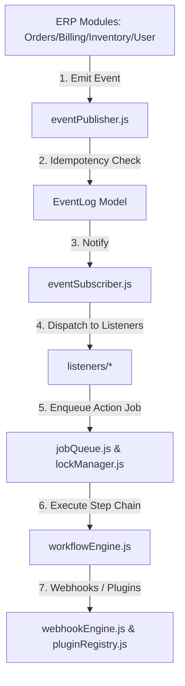

# Automation Core Architecture — Technical Blueprint

## 1. System Topology Diagram

---

## 2. Event Versioning & Replay
Events include `eventVersion` and `schemaVersion` for backward compatibility. Replay service (`eventReplay.js`) enables debugging and disaster recovery.

---

## 3. Distributed Locking & Idempotency
- **Idempotency**: MD5 key generation (`eventName_producer_entityId_timeBucket`) prevents duplicate execution.
- **Distributed Locks**: Resource key TTL locks (`lockManager.js`) prevent race conditions.

---

## 4. Extension Points for Future Plugins
Pluggable registry (`pluginRegistry.js`) allows future plugins (WhatsApp, Email, SMS, Razorpay, PhonePe, GST, AI Assistant) to register without modifying core code.
