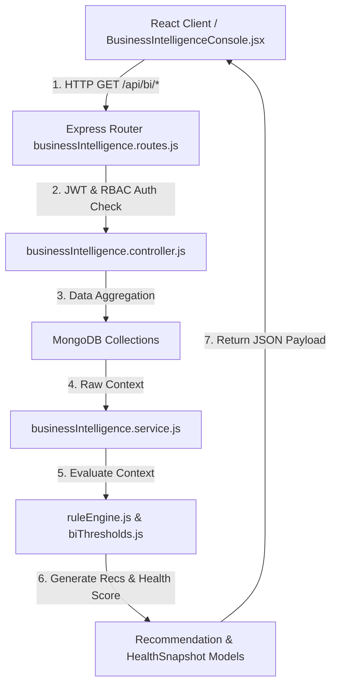

# Business Intelligence Engine Architecture — Technical Blueprint

## 1. System Architecture Diagram

---

## 2. Rule Engine Design & Pluggability
Rules are defined as independent JS objects exposing:
- `ruleId`: Unique string identifier
- `name`: Descriptive rule title
- `category`: Operational module
- `severity`: Critical, Warning, Info, Success
- `priority`: High, Medium, Low
- `evaluate(context)`: Pure function returning `{ triggered: boolean, ...data }`
- `generateRecommendation(result)`: Returns structured recommendation payload with drill-down target path.

To add new rules, simply add an object to `server/src/utils/businessRules/` without modifying core services or API controllers.

---

## 3. Business Health Score Algorithm
Weighted composite index ($0-100$) combining 6 operational dimensions:
- Sales (25%) + Finance (25%) + Inventory (20%) + Customers (15%) + Suppliers (10%) + Operations (5%).
- Configurable weightages in `server/src/config/biThresholds.js`.

---

## 4. Future AI & Automation Extension Plan
The BI Engine exposes standardized JSON outputs containing structured evidence (`reason`), `suggestedAction`, and `estimatedImpact`. This allows seamless integration with:
- **AI Business Assistant**: Prompt templates can directly ingest `getOverview()` JSON payloads as context.
- **WhatsApp Business Bot**: Automated morning summaries can format top recommendations into WhatsApp messages.
- **Automation Engine**: `ruleEngine` triggered recommendations can automatically dispatch push notifications or draft purchase orders.
