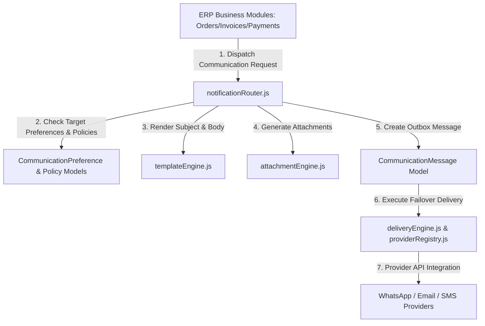

# Communication Engine Architecture — Technical Blueprint

## 1. System Topology Diagram

---

## 2. Omnichannel Conversation Threading
Messages are automatically assigned to an entity conversation (`CommunicationConversation`). Future replies or follow-up notifications extend the timeline seamlessly.

---

## 3. Provider Failover Mechanism
If the primary provider fails, `deliveryEngine` steps through registered providers for that channel before triggering a fallback channel.
