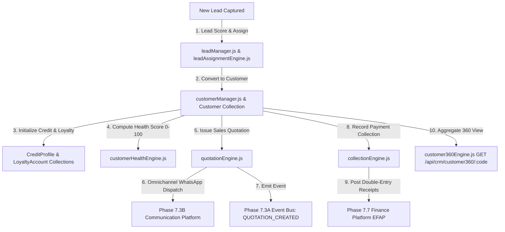

# Enterprise CRM Architecture — Full Technical Blueprint

## 1. Executive Summary
Phase 10 establishes the Enterprise CRM & Customer Experience Platform (ECXP) for Prakriti ERP under `server/src/core/crm/`. ECXP is the single source of truth for the complete customer lifecycle, incorporating a Customer 360 Engine, Centralized Activity Engine, Follow-up & Reminder Engine, Daily Sales Task Engine, Intelligent Lead Assignment Engine, Extensible Lead Scoring Framework, Dynamic Customer Health Engine (0-100 Score), Automated Segmentation Engine, Sales Forecast Engine, Collection Management Engine (Promise-To-Pay & Aging), EDP-Integrated Document Vault, Communication Center, and Event-Driven Automation Workflows.

---

## 2. Component Topology Diagram

---

## 3. System Integrations
- **Phase 7.7 Finance Platform (EFAP)**: Receives double-entry receipt ledger postings from collections (`collectionEngine.js`) and updates customer outstanding balances.
- **Phase 7.8 Supply Chain Platform (EMSCP)**: Verifies real-time multi-warehouse inventory stock (`InventoryStock.js`) during quotation creation.
- **Phase 9 HRMS Platform**: Maps sales executives, territory managers, and commission achievements to employee profiles (`Employee.js`).
- **Phase 7.3B Communication Engine**: Dispatches quotations, payment reminders, delivery updates, and complaint notifications via SMS, Email, and WhatsApp.
- **Phase 7.3A Event Bus**: Emits `LEAD_CREATED`, `LEAD_QUALIFIED`, `OPPORTUNITY_CREATED`, `QUOTATION_CREATED`, `QUOTATION_APPROVED`, `CUSTOMER_CREATED`, `ORDER_CONFIRMED`, `PAYMENT_RECEIVED`, `CUSTOMER_VISIT`, `COMPLAINT_CREATED`, `COMPLAINT_RESOLVED`, and `LOYALTY_UPDATED`.
