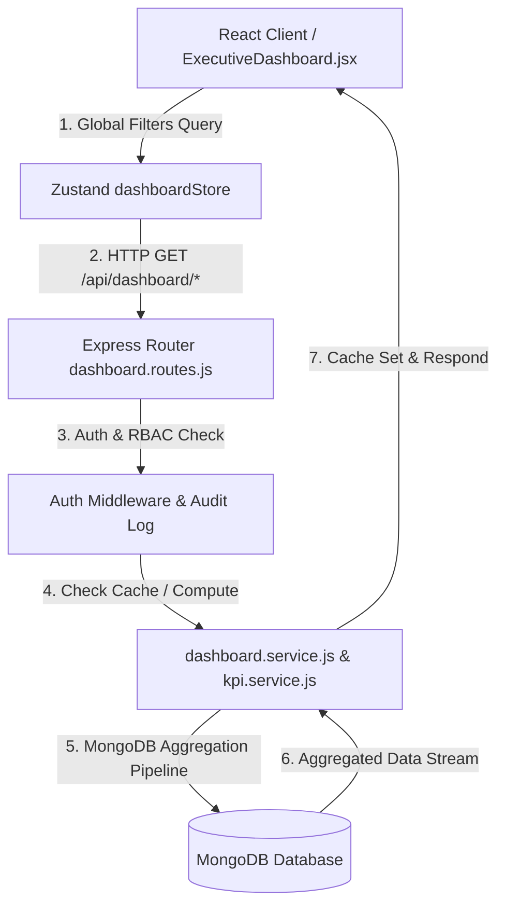

# Enterprise Dashboard Architecture — Technical Blueprint

## 1. Overview & Architectural Principles
The Executive Analytics & Business Intelligence Dashboard is engineered for high throughput, modularity, and future extensibility. It follows a clean 3-tier architecture:
1. **Data & Aggregation Layer (MongoDB + Mongoose)**: Executes single-pass `$facet` aggregation pipelines.
2. **Services & BI Engine Layer (Node.js/Express)**: Decoupled business logic (`dashboard.service.js`, `kpi.service.js`) with server-side caching and audit logging.
3. **Visualization & Presentation Layer (React + Zustand)**: Responsive, glassmorphism UI widgets with global filter state and cloud DB preferences sync.

---

## 2. System Architecture & Data Flow

---

## 3. Modular Components & Layer Responsibilities

### Backend Layering
- **`routes/dashboard.routes.js`**: Defines REST endpoints, attaches `authenticate` middleware, and controls route access.
- **`controllers/dashboard.controller.js`**: Handles HTTP request parsing, error formatting via `response.service.js`, and logs audit trail events.
- **`services/kpi.service.js`**: Reusable BI Engine calculating financial and growth KPIs (AOV, APV, MoM Growth %, Gross Margin %).
- **`services/dashboard.service.js`**: Implements MongoDB aggregation pipelines (`$facet`, `$group`, `$sort`, `$limit`) and manages server-side TTL caching.

### Frontend Layering
- **`store/dashboardStore.js`**: Central Zustand store holding global filters (`timeframe`, `startDate`, `endDate`, `branchId`, `categoryId`), DB preferences, and async fetch actions.
- **`pages/dashboard/ExecutiveDashboard.jsx`**: Main dashboard screen rendering 8 dynamic sections:
  1. Welcome Header & Global Filters
  2. Animated KPI Summary Cards (Revenue, Profit, Orders, Inventory Value)
  3. Revenue & Financial Trend Graphs
  4. Sales & Customer Distribution Analytics
  5. Warehouse Inventory & Stock Exception Warnings
  6. Financial Ledger & Cash Flow
  7. Activity Stream & Audit Logs
  8. Infrastructure & System Health Monitor

---

## 4. Aggregation Design & Performance Strategy
- **Single-Pass Aggregations**: Uses `$facet` to calculate totals, daily counts, pending orders, and status breakdowns in a single query pass.
- **Pre-Aggregated Time Series**: Groups timestamps using `$dateToString: { format: "%Y-%m", date: "$createdAt" }` directly inside MongoDB to send ready-to-render chart datasets.
- **Analytics Caching**: In-memory Map cache with 60-second TTL prevents duplicate DB workload during high concurrent traffic.

---

## 5. Security & RBAC Flow
- **Authentication**: JWT token validation on all endpoints.
- **RBAC Matrix**: Access restricted to `Owner`, `Admin`, and `Manager` roles.
- **Audit Trail**: Every executive dashboard access logs an audit event (`"Executive Dashboard Access"`) capturing user identity, timestamp, and IP address.

---

## 6. Future Extension Points
The architecture is designed to seamlessly integrate upcoming enterprise modules:
- **AI Business Intelligence**: `kpi.service.js` endpoints can be directly consumed by natural language query AI models.
- **Multi-Branch ERP**: Global filter engine (`buildGlobalFilter`) is already pre-built to accept `branchId` and `warehouseId` parameters.
- **WhatsApp & Automated Reports**: Scheduled cron jobs can invoke `kpiService.calculateKPIs()` to format PDF/WhatsApp summary dispatches.
