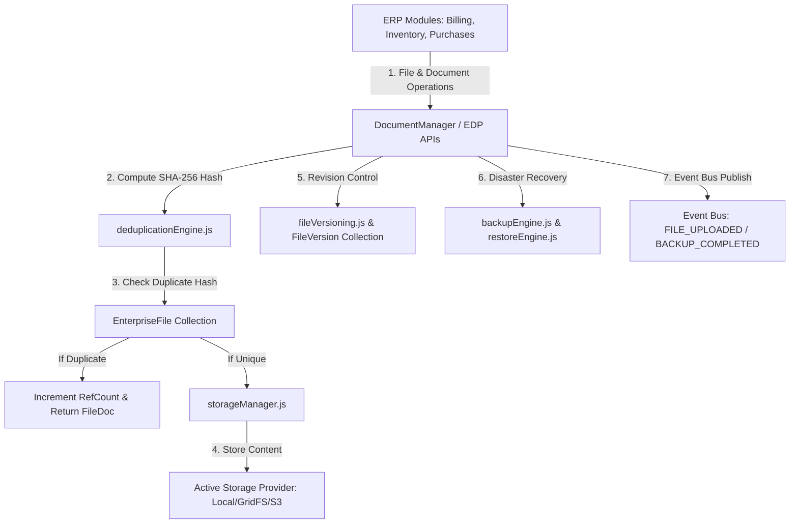

# Enterprise Data Platform Architecture — Full Technical Blueprint

## 1. Executive Overview
Phase 7.4 establishes the Enterprise Data Platform (EDP) for Prakriti ERP. EDP acts as the unified storage, document, backup, versioning, search, import/export, and disaster recovery infrastructure layer.

---

## 2. Component Topology Diagram

---

## 3. Storage Tiering & Retention Policy
Files transition automatically across 4 storage tiers:
1. **Hot Storage**: High frequency access (0 - 90 days).
2. **Warm Storage**: Low frequency access (91 - 365 days).
3. **Cold Archive**: Compliance archive (1 - 3 years).
4. **Offline Archive**: Compressed, encrypted long-term storage (3+ years).

---

## 4. AI & Future Automation Readiness
Payload interfaces ready for future OCR engines, invoice/receipt parsing, image classification, semantic embeddings, and vector database indexing.
