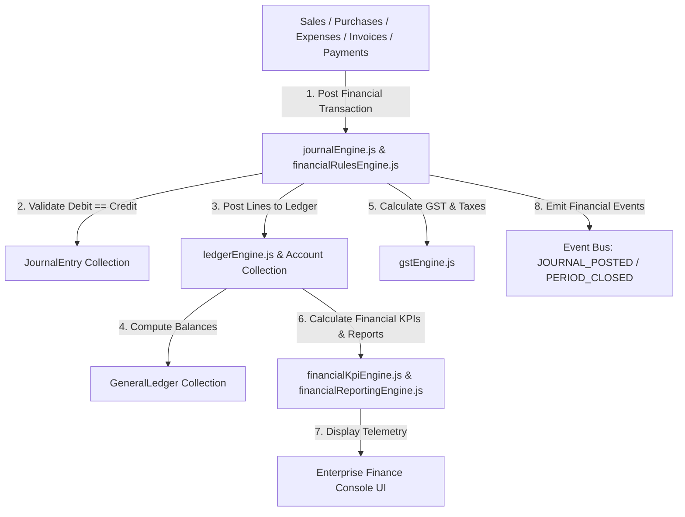

# Enterprise Finance Architecture — Full Technical Blueprint

## 1. Executive Summary
Phase 7.7 establishes the Enterprise Finance & Accounting Platform (EFAP) for Prakriti ERP. EFAP is the centralized double-entry accounting engine responsible for general ledger balances, chart of accounts, AR/AP, Indian GST, financial KPIs, budgeting, fixed assets, and financial reporting across all ERP modules.

---

## 2. Component Topology Diagram

---

## 3. Financial Event & System Integration
- **Event Bus**: Emits `JOURNAL_POSTED`, `PAYMENT_RECEIVED`, `PERIOD_CLOSED`, `BUDGET_UPDATED` events to the Phase 7.3A Event Bus.
- **Business Intelligence**: P&L, EBITDA, Working Capital, and margin telemetry feed directly into Executive Dashboards and BI Engine.
- **Communication Engine**: Dispatches period closing alerts and high-value payment notifications automatically.

---

## 4. Payment Gateway Readiness
Prepared provider registry (`paymentGatewayRegistry.js`) for future payment gateway integrations:
- Razorpay / PhonePe / Cashfree (India)
- Stripe / PayPal (Global)
