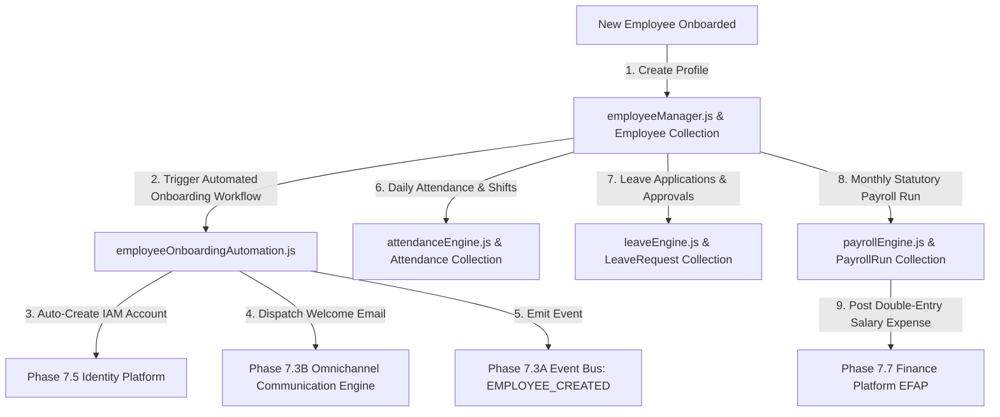

# Enterprise HRMS Architecture — Full Technical Blueprint

## 1. Executive Summary
Phase 9 establishes the Enterprise Human Resource Management Platform (EHRMP) for Prakriti ERP under `server/src/core/hrms/`. EHRMP is the single source of truth for the complete employee lifecycle, organization structure, attendance monitoring, leave management, shift roster planning, finance-integrated payroll processing, performance reviews, recruitment, training, employee documents, hardware assets, biometric integration, and employee self-service (ESS).

---

## 2. Component Topology Diagram

---

## 3. System Integrations
- **Phase 7.5 Identity Platform**: Auto-provisions IAM accounts and security roles upon employee onboarding.
- **Phase 7.7 Finance Platform (EFAP)**: Posts double-entry salary expense and tax liability journal entries directly to the General Ledger.
- **Phase 7.3B Communication Platform**: Dispatches joining letters, payslips, leave approvals, and emergency alerts.
- **Phase 7.3A Event Bus**: Emits `EMPLOYEE_CREATED`, `ATTENDANCE_MARKED`, `LEAVE_APPROVED`, `PAYROLL_COMPLETED`, and `EMPLOYEE_EXITED` events.
