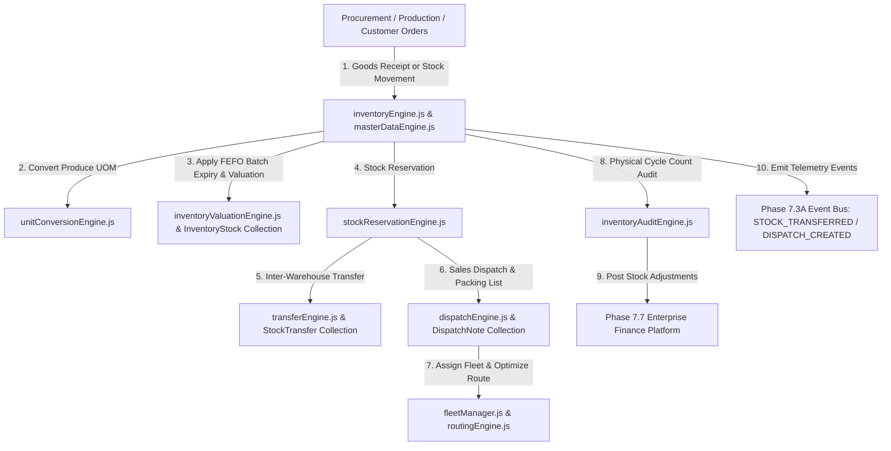

# Enterprise Supply Chain Architecture — Full Technical Blueprint

## 1. Executive Summary
Phase 7.8 establishes the Enterprise Multi-Branch, Warehouse & Supply Chain Platform (EMSCP) for Prakriti ERP under `server/src/core/supplychain/`. EMSCP is the centralized single source of truth for branch regional hierarchies, multi-warehouse facilities, agricultural produce UOM conversions, stock reservations, FEFO batch expiry rules, inter-warehouse transfers, sales dispatch packing lists, vehicle fleet management, delivery route planning, and supplier performance ratings.

---

## 2. Component Topology Diagram

---

## 3. System Integrations
- **Phase 7.7 Finance Platform (EFAP)**: Automatically posts double-entry inventory valuation and stock audit variance adjustments.
- **Phase 7.3A Event Bus**: Emits `STOCK_TRANSFERRED`, `DISPATCH_CREATED`, `RECEIVING_COMPLETED`, and `STOCK_RESERVED` events.
- **Phase 7.2 Business Intelligence**: Computes Inventory Turnover %, Fill Rate %, Stock Aging, and Fast/Slow Moving SKUs for Executive Dashboards.

---

## 4. Cold Chain & Hardware Abstraction
Prepared interfaces for future hardware IoT integrations:
- Cold Storage Temperature / Humidity Sensors (4°C threshold monitoring).
- Barcode / QR Label Scanner Engine & GS1 Code Support.
- Refrigerated Vehicle Fleet GPS Tracking.
