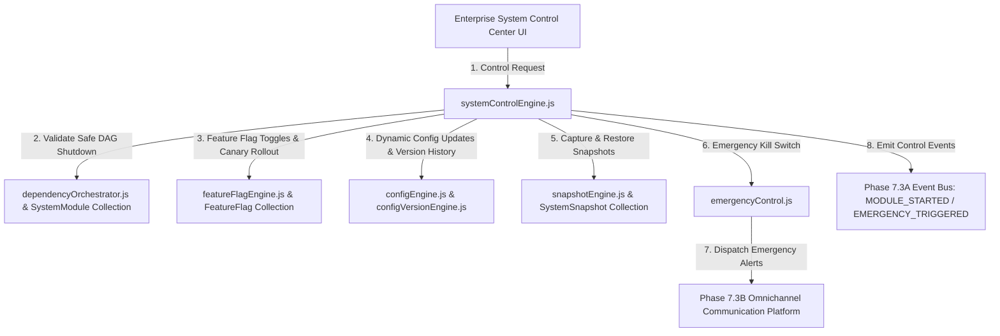

# Enterprise System Control Architecture — Full Technical Blueprint

## 1. Executive Summary
Phase 8 establishes the Enterprise System Control Engine (SCE) for Prakriti ERP under `server/src/core/system-control/`. SCE is the centralized runtime command center responsible for enabling, disabling, configuring, monitoring, and orchestrating every subsystem across the ERP.

---

## 2. Component Topology Diagram

---

## 3. System Integrations
- **Phase 7.3A Event Bus**: Emits `MODULE_STARTED`, `MODULE_STOPPED`, `FEATURE_ENABLED`, `FEATURE_DISABLED`, `CONFIG_UPDATED`, `MAINTENANCE_STARTED`, `MAINTENANCE_STOPPED`, and `EMERGENCY_TRIGGERED` events.
- **Phase 7.3B Communication Platform**: Dispatches emergency alert SMS/WhatsApp/Push notifications to system administrators.
- **Phase 7.6 Observability Platform**: Reads subsystem health status and telemetry.
