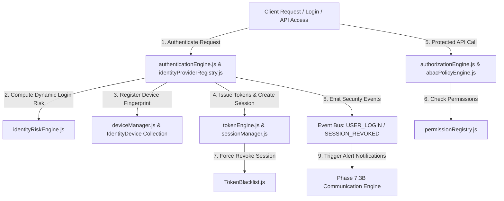

# Enterprise Identity Platform Architecture — Full Technical Blueprint

## 1. Executive Summary
Phase 7.5 establishes the Enterprise Identity & Access Platform (IAM) for Prakriti ERP. IAM becomes the single source of truth for authentication, authorization (RBAC/ABAC), active session management, device trust, API key management, security policy enforcement, and identity audit logging.

---

## 2. Component Topology Diagram

---

## 3. Token Rotation & Sliding Session Architecture
- Access tokens expire after 1 hour (`expiresIn: "1h"`).
- Refresh tokens expire after 7 days (`expiresIn: "7d"`).
- Token revocation writes SHA-256 token hash to `TokenBlacklist.js`, instantly blocking stolen tokens across all cluster nodes.

---

## 4. Future SSO & External Provider Architecture
Interfaces prepared for seamless future integration with:
- OAuth2 (Google, Microsoft, GitHub)
- OpenID Connect (OIDC)
- SAML 2.0 Enterprise SSO
- LDAP / Active Directory Domain Controllers
- Passkeys & Biometric Authentication
