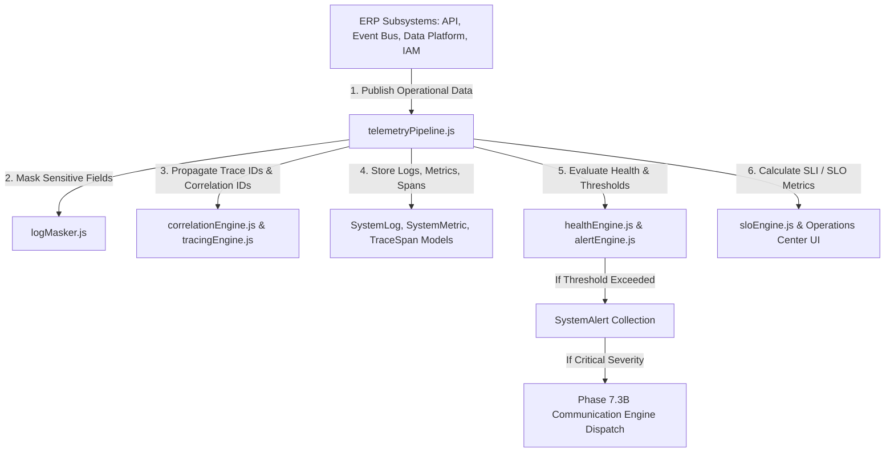

# Enterprise Observability Platform Architecture — Full Technical Blueprint

## 1. Executive Overview
Phase 7.6 establishes the Enterprise Observability Platform (EOP) for Prakriti ERP. EOP is the central operational intelligence layer responsible for logging, metrics, tracing, alerting, diagnostics, and performance profiling across all ERP modules.

---

## 2. Component Topology Diagram

---

## 3. Telemetry Event & Communication Integration
- **Event Bus**: Emits `LOG_CREATED`, `ALERT_TRIGGERED`, `TRACE_COMPLETED`, `METRIC_RECORDED`, and `DIAGNOSTIC_COMPLETED` events to the Phase 7.3A Event Bus.
- **Communication Engine**: Automatically dispatches alerts for critical system events via WhatsApp, Email, or SMS to on-call engineering staff.

---

## 4. Future Collector Plugin Architecture
Prepared interfaces (`observabilityPluginRegistry.js`) for seamless integration with external observability platforms:
- Prometheus / Grafana
- OpenTelemetry Collector
- ElasticSearch / Kibana / Loki
- Jaeger / Zipkin Distributed Tracing
- Datadog / New Relic Enterprise APM
